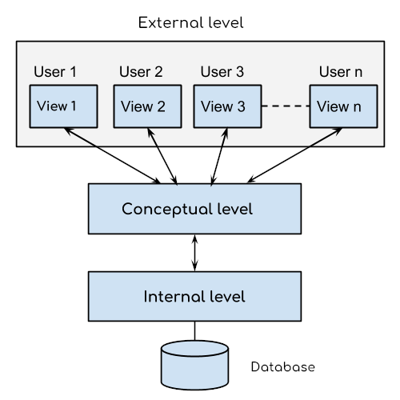

# DBMS

## 1. Describe the three-level architecture of DBMS? 
DBMS architecture has three levels:

1. External level
2. Conceptual level
3. Internal level

#### External level
It is also called view level. The reason this level is called “view” is because several users can view their desired data from this level which is internally fetched from database with the help of conceptual and internal level mapping.

The user doesn’t need to know the database schema details such as data structure, table definition etc. user is only concerned about data which is what returned back to the view level after it has been fetched from database (present at the internal level).

External level is the “top level” of the Three Level DBMS Architecture.
#### Coneptual level
It is also called logical level. The whole design of the database such as relationship among data, schema of data etc. are described in this level.

Database constraints and security are also implemented in this level of architecture. This level is maintained by DBA (database administrator).

#### Internal Level
This level is also known as physical level. This level describes how the data is actually stored in the storage devices. This level is also responsible for allocating space to the data. This is the lowest level of the architecture.
#### Three Level Architecture Diagram


## 2. Explain its importance in a database environment

1. This architecture makes the database abstract. It is used to hide the details of how data is physically stored in a computer system, which makes it easier to use for a user.
2. This architecture allows each user to access the same database with a different customized view of data.

3. This architecture enables a database admin to change the storage structure of the database without affecting the user currently on the system.


## 3. Disadvantages of File Processing System
<b>1. Duplicate Data</b>

Data is stored more than once in different files, that means duplicate data may occur in all these files. Since all the files are independent on each other so it is very difficult to overcome this error and if anyone finds this error then it will take time and effort to solve this issue.

<b>2. Inconsistency</b>

In file processing system, various copies of same data may contain different values. Data is not consistent in this system, it means if a data item needs to be changed then all the files containing that data need to be modified. It may create a risk of out dated values of data.

<b>3. Accessing Anomalies</b>

Accessing anomalies means that it is not easy to access data in a desired or efficient way. It makes supervision of department very difficult. If a user wants information in a specific manner then he requires creating a program for it.

<b>4. Poor Data Integrity</b>

A collection of data is integrated if it meets certain consistency constraints. A programmer always puts these constraints in the programs by adding some codes. In File Processing System, poor data integrity often arises and it becomes very difficult to add new constraints at that time.

For Example: The maximum marks of the student can never be more than 100.

<b>5. Poor Data Security</b>

Poor data security is the most threatening problem in File Processing System. There is very less security in File Processing System as anyone can easily modify and change the data stored in the files. All the users must have some restriction of accessing data up to a level.


<b>6. Atomicity Problem</b>

Atomicity is required to save the data values, it means that information is completely entered or canceled at all. Any system may fail at any time and at that time it is desired that data should be in a consistent state.

<b>7. Wastage of Labor and Space</b>

Labor is very costly in this era and no organization can afford wastage of their precious labor. File Processing System needs lots of copied data in different files that cause wastage of labor. Also maintaining same data again and again leads to wastage of space too.

<b>8. Data Isolation</b>

Data is isolated in File Processing System and data is stored in different files. These files can be in different formats. If you want to extract data from two file then you are required to which part of the file is needed and how they are related to each other.

## 4. Discuss in detail the operators SELECT, PROJECT, UNION with suitable example?

1. SELECT (σ)

The SELECT operation is used for selecting a subset of the tuples according to a given selection condition. Sigma(σ)Symbol denotes it. It is used as an expression to choose tuples which meet the selection condition. Select operator selects tuples that satisfy a given predicate.

```
σp(r)

σ is the predicate
r stands for relation which is the name of the table
p is prepositional logic
```
Example

σ<sub>topic</sub> = <sub>"Database"</sub> (Tutorials)

Output – Selects tuples from Tutorials where topic = ‘Database’.

2. PROJECTION(π)

The projection eliminates all attributes of the input relation but those mentioned in the projection list. The projection method defines a relation that contains a vertical subset of Relation. This helps to extract the values of specified attributes to eliminates duplicate values. (pi) symbol is used to choose attributes from a relation. This operator helps you to keep specific columns from a relation and discards the other columns.

Example of Projection:

Consider the following table

| CustomerID      | CustomerName | Status     |
| :---        |    :----:   |          ---: |
| 1   | Google      | active   |
| 2   | Amazon      | active   |
| 3   | Apple       | inactive   |
| 4   | Alibaba       | active   |

Here, the projection of CustomerName and status will give,


Π <sub>CustomerName, Status</sub> (Customers)


| CustomerName| Status     |
|    :----:     |     ---: |
| Google      | active   |
| Amazon      | active   |
| Apple       | inactive |
| Alibaba     | active   |

3. UNION  (∪)

UNION is symbolized by ∪ symbol. It includes all tuples that are in tables A or in B. It also eliminates duplicate tuples. So, set A UNION set B would be expressed as:

The result <- A ∪ B

For a union operation to be valid, the following conditions must hold –
* R and S must be the same number of attributes.
* Attribute domains need to be compatible.
* Duplicate tuples should be automatically removed.

Example

Consider the following tables.

<table>
<tbody>
<tr>
<th colspan="2"><center>Table A</center></th>
<td></td>
<th colspan="2"><strong><center>Table B</center></strong></th>
</tr>
<tr>
<th>column 1</th>
<th>column 2</th>
<th></th>
<th>column 1</th>
<th>column 2</th>
</tr>
<tr>
<td>1</td>
<td>1</td>
<td></td>
<td>1</td>
<td>1</td>
</tr>
<tr>
<td>1</td>
<td>2</td>
<td></td>
<td>1</td>
<td>3</td>
</tr>
</tbody>
</table>

A ∪ B gives

<table>
<tbody>
<tr>
<th colspan="2"><center>Table A ∪ B</center></th>
</tr>
<tr>
<th>column 1</th>
<th>column 2</th>
</tr>
<tr>
<td>1</td>
<td>1</td>
</tr>
<tr>
<td>1</td>
<td>2</td>
</tr>
<tr>
<td>1</td>
<td>3</td>
</tr>
</tbody>
</table>
## 5.
